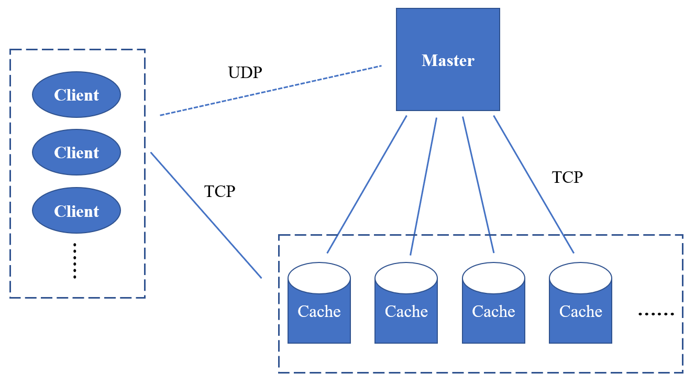

# 项目简介
分布式存储系统

本系统为一个基于Linux系统的分布式缓存系统，集群中包含一台master_server及多台cache_server。master_server采用一致性哈希管理cache_server，构建数据在集群中的分布信息。cache server 负责数据的存储，并按照Master的指示完成数据的复制和迁移工作。Client 在启动的时候，从master_server获取数据分布信息，根据数据分布信息，和相应的cache_server进行交互，完成用户的请求。

# 服务器提供的服务

## master_server

1，通过一致性哈希管理cache_server
    	ceche_server上线时进行扩容，cache_server掉线时通过容灾机制重构数据映射	
2，向client提供的服务
        计算Hash(key)，告知client应该连接哪台cache_server进行数据读写

## cache_server

1，采用LRU管理数据
		向client提供数据的增删查改服务
2，数据的迁移、备份和恢复
		在cache_server上线和掉线时保证存储系统运作正常

# 系统框架

总体架构

# 扩容机制

1、什么时候需要扩容

​		当分布式缓存系统中有新的cache_server上线时，部分存储节点的数据需要进行迁移，将不属于自身的数据迁移到新增加的cache_server中，此过程为多对一

2、扩容步骤

​		1）master_server将新注册的cache_server添加到一致性哈希中，通知所有cache_server更新一致性哈希，并将新的备份服务器IP也发送给所有cache_server，然后开始搬移数据，标记服务器的状态为”扩容“状态

​		2）cache_server收到搬移数据的指令后，对当前存储的key做一个快照，根据新的一致性哈希计算每个数据是否需要搬移，如果需要搬移，就将数据写到新的cache_server中，然后将该数据标记为dirty，同时将其原备份服务器中的数据也标记为dirty，完成所有数据搬移后，通知master_server搬移结束。

​		3）当master_server收到所有cache_server搬移结束的通知时，标记服务器状态为”正常”状态

3、扩容时如何读取数据

​		扩容时master_server被标记为“扩容”状态。此时如果有client请求获取数据分布，因为服务器不知道这个数据有没有被搬到新的cache_server上，返回数据如下：

​		*原IP*

​		*新IP*

​		*新备份IP*

client在读数据的时候，首先去原IP上读，如果读到数据为dirty或者读不到数据，就说明数据已经被移走了，就去新的IP上读

​		这样便保证了扩容时依然可以正确读取数据

4、扩容时如何写数据

​		忽略返回的原IP（返回的第一个IP），直接将数据写到新的IP（返回的第二个IP）上

# 容灾机制

1、什么时候触发容灾机制

​		当有cache_server掉线的时候，需要将已经掉线的cache_server的备份服务器中的数据备份恢复到存活的服务器中，同时重建备份

2、容灾步骤

​		1）master_server通知所有cache_server更新一致性哈希和新的备份服务器IP，然后通知掉线服务器的备份服务器开始根据新的一致性哈希恢复数据，将服务器标记为“恢复”状态“

​		2）cache_server接收到恢复数据的通知时，建立一份备份数据的快照，依次重新计算备份数据的新存储IP，将数据写到新的服务器上，并且将原备份数据标记为dirty，当数据恢复完成后通知master_server数据恢复完毕

​		3）当master_server收到数据恢复完毕的通知时，标记服务器状态为”正常”状态

3、容灾时如何读取数据

​		容灾时原服务器已经掉线了，client只能去备份服务器或者新的服务器上读，返回数据如下：

​		*原备份IP*

​		*新IP*

​		*新备份IP*

client读数据的时候，首先去去原备份IP，如果读不到或者读到数据为dirty，说明数据已经被恢复了，就去新IP上读

​		保证了容灾时依然能读取到数据

4、容灾时如何写数据

​		忽略返回的原备份IP（返回的第一个IP），直接将数据写到新的IP（返回的第二个IP）上

